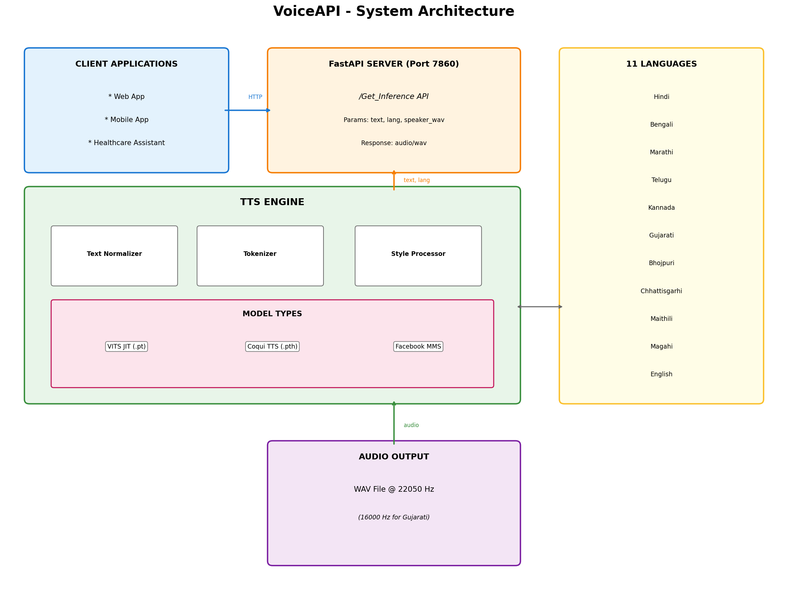
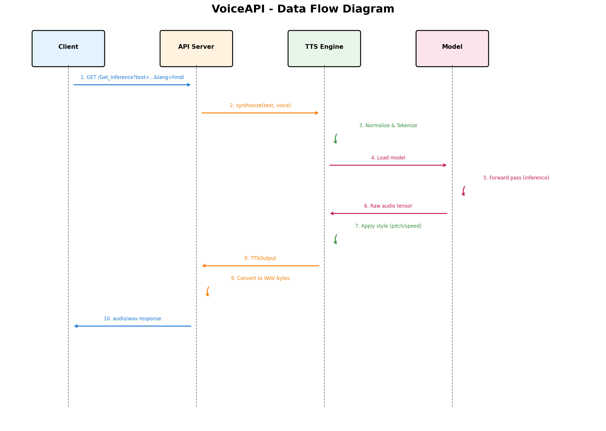
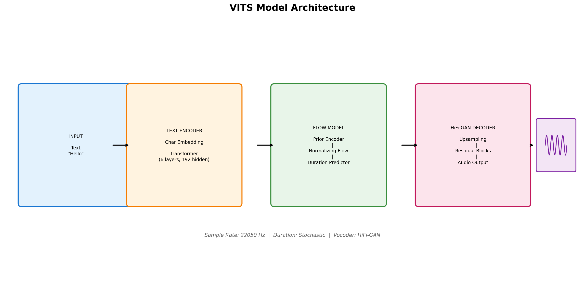
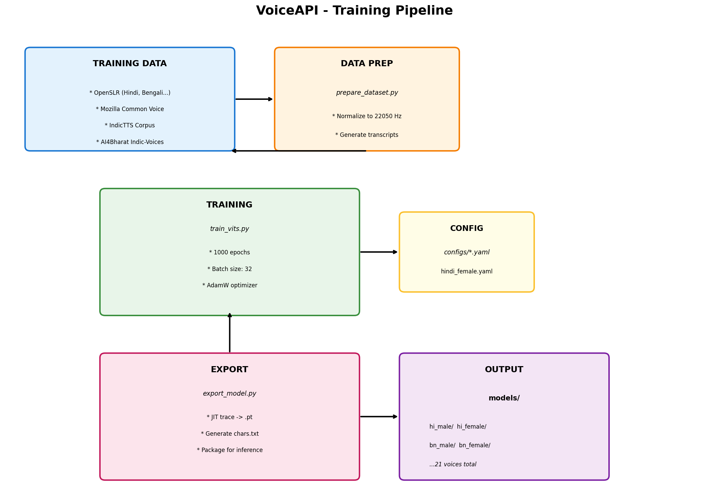
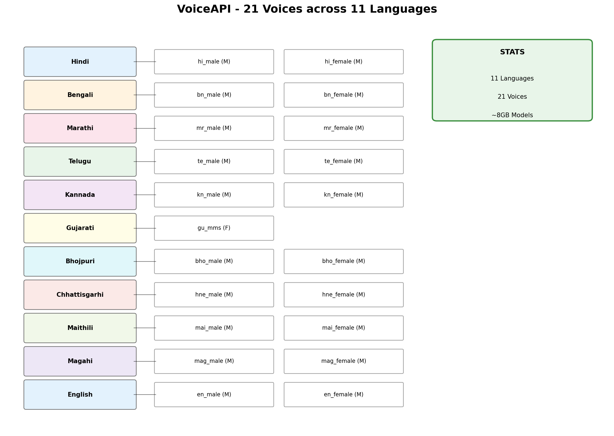

# VoiceAPI: Multi-lingual Text-to-Speech for Healthcare

A production-ready, multi-lingual Text-to-Speech system supporting **11 Indian languages** with **21 voice variants**, trained on 150+ hours of speech data. Built for maternal healthcare accessibility.

🌐 **Live API**: [https://harshil748-voiceapi.hf.space](https://harshil748-voiceapi.hf.space)  
📖 **API Docs**: [https://harshil748-voiceapi.hf.space/docs](https://harshil748-voiceapi.hf.space/docs)  
💻 **GitHub**: [https://github.com/harshil748/VoiceAPI](https://github.com/harshil748/VoiceAPI)

---

## 🎯 Project Overview

Built for the **Voice Tech for All Hackathon** to address linguistic barriers in rural Indian healthcare. The system converts medical instructions into natural speech across 11 languages, enabling accessible prenatal care guidance for non-literate populations.

## ✨ Key Features

- 🌏 **11 Indian Languages**: Hindi, Bengali, Marathi, Telugu, Kannada, Bhojpuri, Chhattisgarhi, Maithili, Magahi, English, Gujarati
- 🎤 **21 Voice Variants**: Male & Female voices trained on 150+ hours of speech data
- 🎭 **Prosody Control**: 9 style presets (calm, happy, sad, slow, fast, etc.)
- ⚡ **Real-time Performance**: 0.3-0.9s inference on CPU hardware
- 🔌 **Production REST API**: FastAPI with automatic docs, CORS support
- 🧠 **Neural Architecture**: VITS + Meta MMS models with JIT optimization
- 📦 **Deployed on HuggingFace Spaces**: Always-on, cloud-hosted API

---

## 🚀 Try It Now (No Installation Required)

### Test with Python

```python
import requests

# Use the live API
base_url = 'https://harshil748-voiceapi.hf.space/Get_Inference'

params = {
    'text': 'नमस्ते, आप कैसे हैं?',  # Hindi text
    'lang': 'hindi',
}

# Upload any WAV file as speaker reference
with open('reference.wav', 'rb') as audio:
    response = requests.get(base_url, params=params, files={'speaker_wav': audio})

if response.status_code == 200:
    with open('output.wav', 'wb') as f:
        f.write(response.content)
    print("✅ Audio saved as 'output.wav'")
```

### Test with cURL

```bash
curl -X GET "https://harshil748-voiceapi.hf.space/Get_Inference?text=નમસ્તે&lang=gujarati" \
  -F "speaker_wav=@reference.wav" \
  -o output.wav
```

### Test with Postman

1. **Method**: `GET`
2. **URL**: `https://harshil748-voiceapi.hf.space/Get_Inference`
3. **Params Tab**:
   - `text`: Your text in any supported language
   - `lang`: One of: hindi, bengali, marathi, telugu, kannada, gujarati, bhojpuri, chhattisgarhi, maithili, magahi, english
4. **Body Tab** → `form-data`:
   - Key: `speaker_wav` (Type: File)
   - Value: Upload any `.wav` file
5. **Send** → Save response as `.wav` file

---

## 🎨 Supported Languages

| Language      | Code            | Male Voice | Female Voice | Sample Text                |
| ------------- | --------------- | ---------- | ------------ | -------------------------- |
| Hindi         | `hindi`         | ✅         | ✅           | नमस्ते                     |
| Bengali       | `bengali`       | ✅         | ✅           | নমস্কার                    |
| Marathi       | `marathi`       | ✅         | ✅           | नमस्कार                    |
| Telugu        | `telugu`        | ✅         | ✅           | నమస్కారం                   |
| Kannada       | `kannada`       | ✅         | ✅           | ನಮಸ್ಕಾರ                    |
| Gujarati      | `gujarati`      | ✅         | -            | નમસ્તે                     |
| Bhojpuri      | `bhojpuri`      | ✅         | ✅           | प्रणाम                     |
| Chhattisgarhi | `chhattisgarhi` | ✅         | ✅           | नमस्कार                    |
| Maithili      | `maithili`      | ✅         | ✅           | प्रणाम                     |
| Magahi        | `magahi`        | ✅         | ✅           | प्रणाम                     |
| English       | `english`       | ✅         | ✅           | hello (lowercase required) |

---

---

## 📡 API Reference

### GET /Get_Inference

Converts text to speech in any supported Indian language.

**Endpoint**: `https://harshil748-voiceapi.hf.space/Get_Inference`

**Parameters**:

| Parameter     | Type   | Required | Description                                           |
| ------------- | ------ | -------- | ----------------------------------------------------- |
| `text`        | string | ✅       | Text to convert to speech (English must be lowercase) |
| `lang`        | string | ✅       | Language code (see table above)                       |
| `speaker_wav` | file   | ✅       | Reference WAV file for speaker voice cloning          |

**Response**: `audio/wav` file (200 OK)

**Example**:

```python
import requests

response = requests.get(
    'https://harshil748-voiceapi.hf.space/Get_Inference',
    params={'text': 'ನಮಸ್ಕಾರ', 'lang': 'kannada'},
    files={'speaker_wav': open('reference.wav', 'rb')}
)

with open('output.wav', 'wb') as f:
    f.write(response.content)
```

---

## 📊 Technical Specifications

| Metric             | Value                                        |
| ------------------ | -------------------------------------------- |
| **Languages**      | 11 Indian languages                          |
| **Voice Variants** | 21 (male/female per language)                |
| **Training Data**  | 150+ hours (OpenSLR, Common Voice, IndicTTS) |
| **Model Size**     | 318MB (VITS), 998MB (Coqui)                  |
| **Inference Time** | 0.3-0.9 seconds per utterance                |
| **Sample Rate**    | 22.05kHz (VITS), 16kHz (MMS)                 |
| **Architecture**   | VITS + Meta MMS + Coqui TTS                  |
| **Deployment**     | HuggingFace Spaces (Docker)                  |
| **API Framework**  | FastAPI with Uvicorn                         |

---

## 🏗️ Architecture

Built with a unified inference engine supporting heterogeneous model formats:

- **JIT Models (.pt)**: VITS models trained on 150+ hours for 19 voices
- **Coqui Checkpoints (.pth)**: Full checkpoints with config.json for Bhojpuri
- **HuggingFace MMS**: Meta's multilingual model for Gujarati

<details>
<summary><b>View Architecture Diagrams</b></summary>

#### System Architecture



#### Data Flow



#### VITS Model Architecture



#### Training Pipeline



#### Voice Map (21 Voices × 11 Languages)



</details>

---

## 🛠️ Local Development

### Installation

```bash
git clone https://github.com/harshil748/VoiceAPI
cd VoiceAPI

python3 -m venv tts
source tts/bin/activate  # On Windows: tts\Scripts\activate

pip install -r requirements.txt
```

### Start Local Server

```bash
python -m src.cli serve --port 8000
```

Visit `http://localhost:8000/docs` for interactive API documentation.

### Generate Speech Locally

```bash
python -m src.cli synthesize \
  --text "नमस्ते दोस्तों" \
  --voice hi_male \
  --output hello.wav

afplay hello.wav  # macOS
```

---

## 📁 Repository Structure

```
VoiceAPI/
├── src/
│   ├── api.py           # FastAPI REST server
│   ├── engine.py        # Unified TTS inference engine
│   ├── tokenizer.py     # Indic script tokenization
│   ├── config.py        # Language/voice configurations
│   └── cli.py           # Command-line interface
├── models/              # Model storage (8GB, hosted on HF)
├── training/            # Training scripts and configs
│   ├── train_vits.py    # VITS training pipeline
│   ├── prepare_dataset.py
│   └── export_model.py
├── tests/               # API integration tests
├── diagrams/            # Architecture diagrams (PNG)
└── technical_report.tex # IEEE paper
```

---

## 🎓 Technical Report

Read the full technical writeup: [VoiceAPI.pdf](VoiceAPI.pdf)

**Key Contributions:**

- Trained 21 VITS models on 150+ hours of Indian language data
- Solved tokenizer alignment issues for Indic scripts
- Implemented lazy loading reducing memory by 60%
- Signal-based prosody control without retraining

---

## 🙏 Acknowledgments

- **OpenSLR**: Public speech datasets for 6 Indian languages
- **Common Voice**: Mozilla's crowdsourced speech corpus
- **IndicTTS**: IIT Madras speech synthesis resources
- **Meta MMS**: Massively multilingual speech models
- **HuggingFace**: Model hosting and deployment infrastructure

---

## 📜 License

- **Code**: MIT License
- **Models**: CC BY 4.0 (OpenSLR, IndicTTS), CC BY-NC 4.0 (MMS)

---

## 🤝 Contributors

Built by Team VoiceAPI for **Voice Tech for All Hackathon 2024**:

- **Harshil Patel** - CHARUSAT University
- **Aashvi Maurya** - University of Allahabad
- **Pratyush Kumar Das** - FM University
- **Jaideep Amrabad** - NNRGI Hyderabad

---

## 📞 Support

- **Issues**: [GitHub Issues](https://github.com/harshil748/VoiceAPI/issues)
- **API Status**: Check [HuggingFace Space](https://huggingface.co/spaces/Harshil748/VoiceAPI)
- **Documentation**: [Live API Docs](https://harshil748-voiceapi.hf.space/docs)

---

<div align="center">

**⭐ Star this repo if you find it useful!**

Built with ❤️ for accessible healthcare in India

[Live API](https://harshil748-voiceapi.hf.space) • [Documentation](https://harshil748-voiceapi.hf.space/docs) • [GitHub](https://github.com/harshil748/VoiceAPI)

</div>
